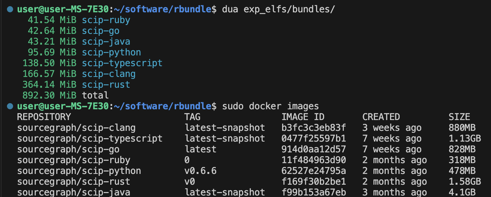

# sidebundle

中文 | [English](README.md)

sidebundle 用于从动态链接的 ELF 可执行文件构建可迁移的离线包。CLI 可以从宿主机或 OCI 镜像（Docker/Podman）采集可执行文件，静态解析和运行时跟踪它们加载的文件，并生成可移植的目录结构（附启动器和 manifest）。


依靠sidebundle，你能：
* 自动最小化Docker镜像，且无需runc等runtime即可在任意linux上运行
* 将软件/工作流依赖的多个elf打包成一个可迁移的bundle

## 文档入口
- [安装/构建/开发](https://github.com/xiaoniaoyouhuajiang/sidebundle/blob/docs-permissions/docs/install.md)
- [更详细的 CLI 用法](https://github.com/xiaoniaoyouhuajiang/sidebundle/blob/docs-permissions/docs/usage.md)
- [tracing backend](https://github.com/xiaoniaoyouhuajiang/sidebundle/blob/docs-permissions/docs/tracing.md)
- [权限矩阵](https://github.com/xiaoniaoyouhuajiang/sidebundle/blob/docs-permissions/docs/permissions.md)
- [特殊场景备忘](https://github.com/xiaoniaoyouhuajiang/sidebundle/blob/docs-permissions/docs/special_handling.md)
- [FAQ](https://github.com/xiaoniaoyouhuajiang/sidebundle/blob/docs-permissions/docs/faq.md)

## 效果演示
scip-index应用打包前后占用空间对比


1.基础演示：不再被‘glibc_x not found’和'libx.so: cannot open shared object'困扰

https://github.com/user-attachments/assets/0b0b1e63-c268-4217-afb0-489168ec6ece

2.镜像用法：从docker（或者是podman）镜像中提取shebang script(javascript)和背后的elf依赖（node）到另一个完全不同的linux环境下完美运行

https://github.com/user-attachments/assets/0d4f2ec8-2864-4a33-ab3f-e51773a10af2

## 安装
- 推荐：使用 GitHub Releases 的 musl 静态二进制（详见 `docs/install.md`）。
- 从源码构建：`cargo build --release` 或 `cargo install --path sidebundle-cli`（详见 `docs/install.md`）。

## 快速开始（使用 musl 静态二进制）
从 GitHub Releases 获取预编译的 musl 静态版（例如 `sidebundle-x86_64-musl` 或 `sidebundle-aarch64-musl`），无需额外依赖即可运行。

### 场景 A：打包 Python 脚本到无 Python 的机器
确保脚本带有正确的 shebang（如 `#!/usr/bin/env python3`），然后：

```bash
./sidebundle-x86_64-musl create \
  --name hello-py \
  --from-host "./examples/hello.py" \
  --out-dir bundles \
  --trace-backend combined \
  --log-level info
```

得到的 `hello-py/bin/hello.py` 会使用 bundle 内的 Python，在未安装 Python 的主机上也能运行。

### 场景 B：从 Alpine 镜像提取 `jq` 在 Ubuntu 上运行

```bash
./sidebundle-x86_64-musl create \
  --name jq-alpine \
  --from-image "docker://alpine:3.20::/usr/bin/jq::trace=--version" \
  --out-dir bundles \
  --image-trace-backend agent-combined \
  --log-level info
```

输出的 `jq-alpine/bin/jq` 为可移植启动器，运行时不再依赖 Docker（仅构建时需要）。

更多内容（CLI 细节、trace backend 原理、权限矩阵、常见问题排查）请从上面的“文档入口”开始阅读。
